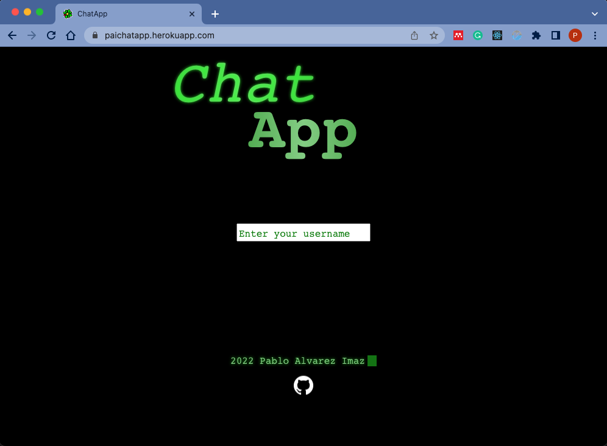

# ChatApp - Client - Project 4

## Project description

A proof of concept, real-time message app using React as Front end and Express as Back end, served by Socket.io as a websocket implementation.

See the app [here](https://paichatapp.herokuapp.com/){:target='\_blank'}

This is served by the ChatApp Server [here](https://github.com/palvarezimaz/chatapp-server){:target='\_blank'}.

You can find every file to run this app in the above mentioned repo.

### General Approach

As a POC, the general approach was to give an overview to the documentation.

### Key features

- Socket.io based real-time messaging for a number of Users
- Direct messaging by unique user indeed
- Username selection
- Friendly CSS layout and retro sound effects

## How it looks

This is the CSS animated landing page:

## Tech Stack

### Back end

- Express JS
- Socket io

### Front end

- React
- SCSS

#### NPM packages

This project uses:

- Node.js v16.14.2
- React v18.2.0
- Socket.io v
- Socket.io-client v4.5.1
- Express.js v4.18.1
- Sass v1.53.0
- Uifx v2.0.7

## Instructions

- To install and deploy in production:

1. Clone the [server](https://github.com/palvarezimaz/chatapp-server){:target='\_blank'}
2. Run `npm i` to install all the dependancies
3. Deploy to your favourite service.

### Note:

For development, mind that the client runs through PORT 3000 and the server (server.js) through PORT 3002.

## Stories

- A user can pick its Username
- A user can send messages in a general chat room
- A user can send a direct message to another user

## Development plan

- Implement WebSockets (via Socket.io) to enable messaging between clients

- (.this += layout and css === MVP)

- Implement direct messages between users

## Conclusion: commentaries, bugs and design flaws

Building an app using WebSockets (Socket.io) in a week was a beautiful challenge at this stage of my carrer. It was indeed a way to dive into something quite new (what they usually call leave the comfort zone, although there were few comfortable spots left besides CSS and vanilla JS)

More soon

## Upcoming features

While I consider that the POC has been satisfactory, It would be nice to:

- Fix the private messaging.
- Add a persistent instance
- Combine with a DB (PostgreSQL)
- Chat Rooms
- Export conversations
- Image sharing

## Credits

i. Socket.io creators.
ii. The cool CSS typed animation was taken from Brandon McConnell Codepen: https://codepen.io/brandonmcconnell/pen/bZqGdw
iii. All and every one that make the Internet the one true Forum of the XXIth Century
